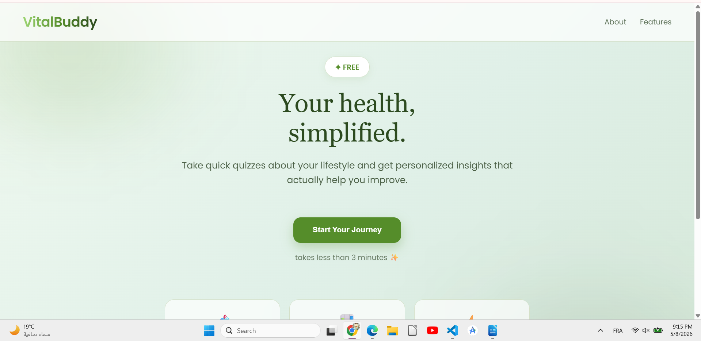
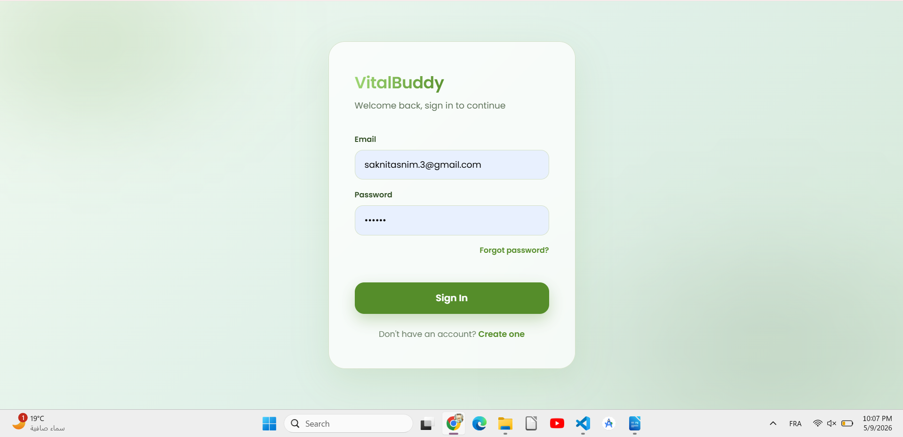
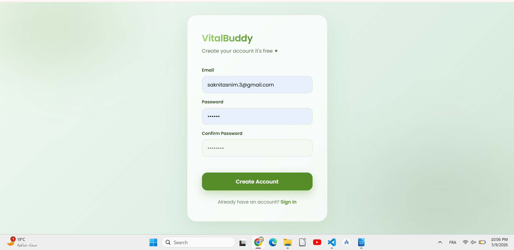
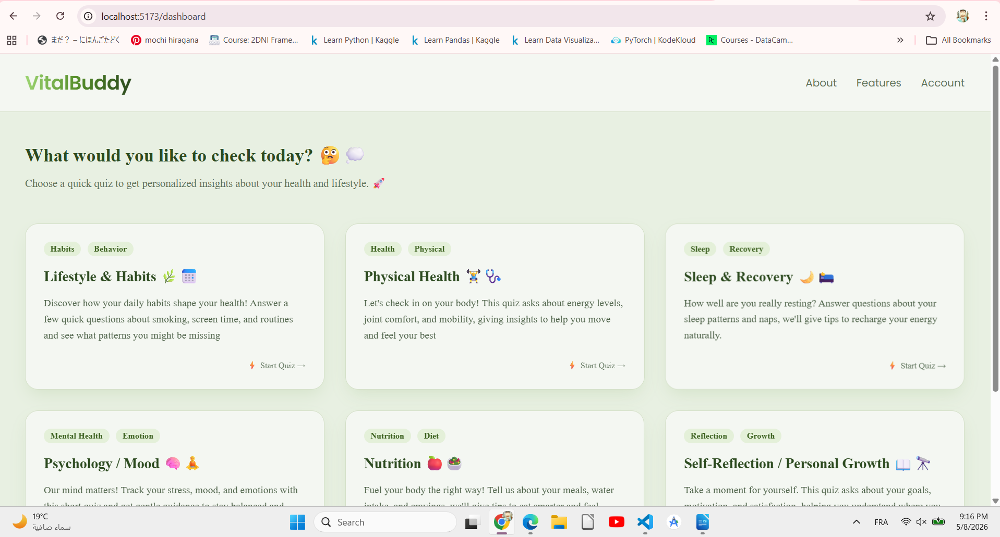
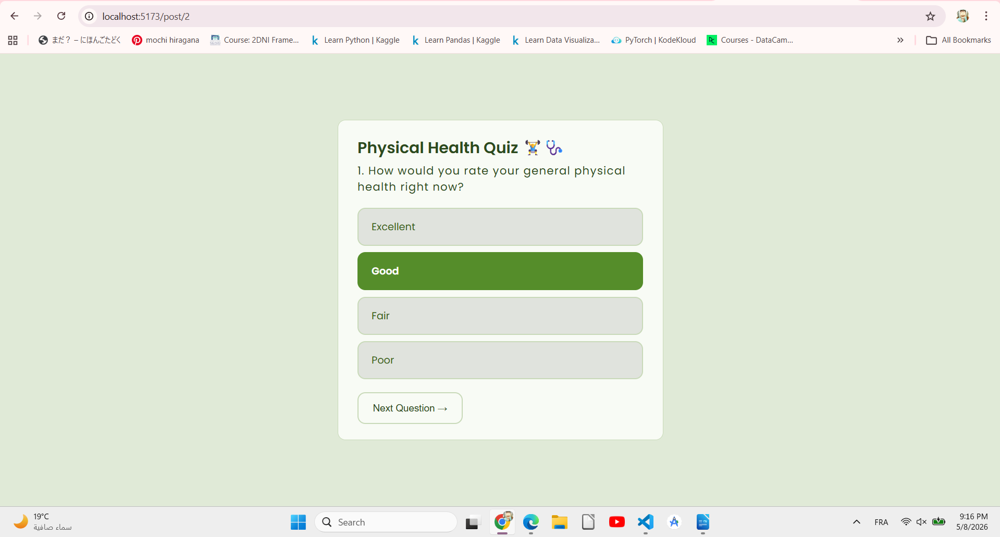
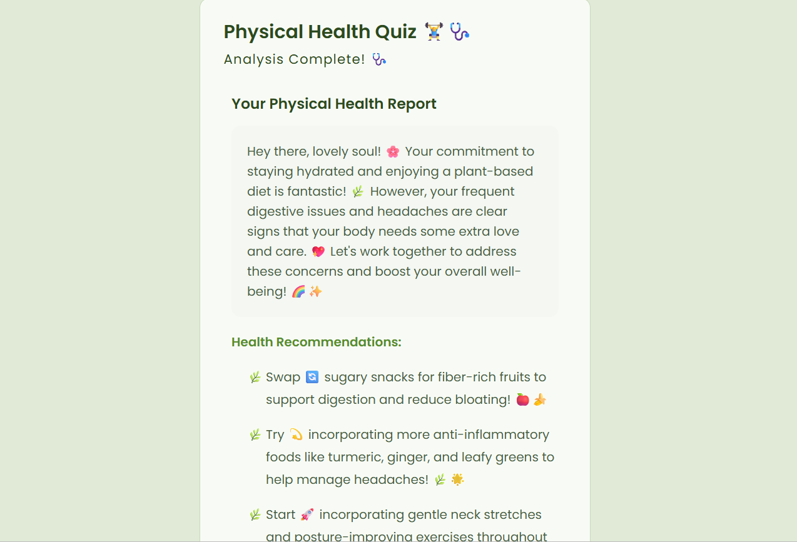
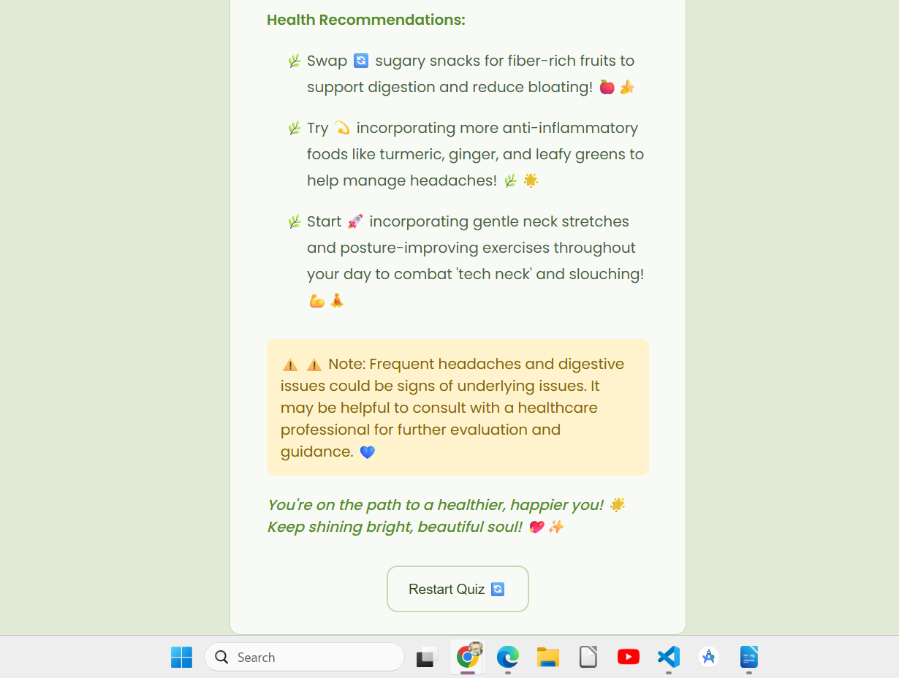
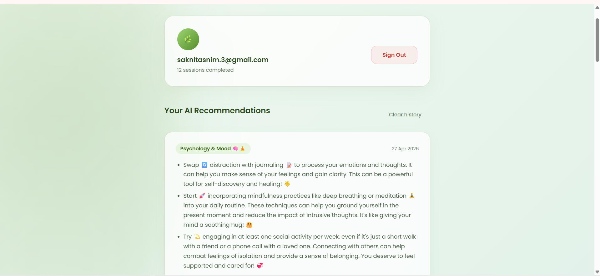

# 💚 VitalBuddy

> Your AI-powered personal health companion, honest, warm, and always on your side.

A full-stack **LLM-powered** health web application that guides users through personalized health quizzes across 6 categories and delivers AI-generated recommendations, motivational insights, and health warnings  all through a conversational AI with a warm, empathetic personality designed to make users feel safe and supported.

---

## 🤖 LLM at the Core

VitalBuddy is built around **Large Language Model (LLM) integration** as its primary intelligence layer. User quiz responses are collected, structured, and sent to **GPT-3.5 Turbo via OpenRouter API**, which generates a fully personalized 3-part health analysis:

- ✅ **Recommendations** : actionable, personalized health advice
- 💪 **Motivation** : warm, encouraging message tailored to the user's situation
- ⚠️ **Warnings** : honest flags about potential health risks

The AI is prompted with a carefully designed **sweet-talker personality**  it speaks like a trusted friend, not a clinical report, making users comfortable engaging honestly with their health data.

---

## ✨ Features

- 🔐 **User Authentication** : Register and login securely via Firebase Auth
- 🗂️ **6 Health Categories** : Each with its own dedicated quiz:
  - 🥗 Nutrition
  - 🏃 Physical Health
  - 🧠 Psychology & Mood
  - 😴 Sleep
  - 🪞 Reflection & Personal growth
  - ❤️ Lifestyle & Habits
- 🔗 **Dynamic Questions** : Questions adapt based on previous answers (built in vanilla JS)
- 🤖 **LLM-Powered Analysis** : GPT-3.5 Turbo generates personalized feedback via OpenRouter
- 📋 **3-Part AI Response** : Recommendations + Motivation + Warnings for every quiz
- 📅 **History Tracking** : Users can view all past quizzes with dates in their account dashboard
- 🔥 **Firebase Backend** : Auth and history storage powered by Firebase

---

## 📸 Screenshots

### 🏠 Home


### 🔐 Authentication
| Sign In | Create Account |
|---------|----------------|
|  |  |

### 🗂️ Quiz Experience
| Categories | Quiz |
|-----------|------|
|  |  |

### 🤖 AI Results
| Result Part 1 | Result Part 2 |
|--------------|--------------|
|  |  |

### 📅 History Dashboard


---

## 🏗️ Architecture

```
vitalbuddy/
├── src/
│   ├── pages/
│   │   ├── Post1.jsx          # Nutrition quiz
│   │   ├── Post2.jsx          # Physical health quiz
│   │   ├── Post3.jsx          # Psychology quiz
│   │   ├── Post4.jsx          # Sleep quiz
│   │   ├── Post5.jsx          # Reflection quiz
│   │   └── Post6.jsx          # General health quiz
│   ├── nutritionQuestions.js
│   ├── physicalHealthQuestions.js
│   ├── psychologyQuestions.js
│   ├── sleepQuestions.js
│   ├── reflectionQuestions.js
│   ├── questions.js
│   ├── firebase.js            # Firebase config
│   ├── Login.jsx
│   ├── Register.jsx
│   ├── Account.jsx            # Quiz history dashboard
│   ├── ProtectedRoute.jsx
│   └── App.jsx
├── ai.py                      # FastAPI backend  handles LLM calls to OpenRouter
├── home.html                  # Landing page
├── .env                       # API keys (not included)
├── .env.example               # Environment variable template
└── vite.config.js
```

---

## 🔬 How It Works

1. User registers/logs in via Firebase Auth
2. Selects one of 6 health categories
3. Dynamic JS quiz adapts questions based on previous answers
4. All answers are collected and sent to the **FastAPI backend**
5. Backend structures the data and calls **GPT-3.5 Turbo via OpenRouter API**
6. LLM generates a warm, personalized 3-part health analysis
7. Results are saved to **Firebase Firestore** with a timestamp
8. User can revisit all past results from their Account dashboard

---

## 🚀 Getting Started

### Prerequisites
- Node.js 18+
- Python 3.10+
- Firebase project (Auth + Firestore enabled)
- OpenRouter API key (free at [openrouter.ai](https://openrouter.ai))

### Frontend

```bash
npm install
npm run dev
```

### Backend

```bash
pip install -r requirements.txt
uvicorn ai:app --reload
```

### Environment Variables

Create a `.env` file in the root:

```
VITE_FIREBASE_API_KEY=your_key
VITE_FIREBASE_AUTH_DOMAIN=your_project.firebaseapp.com
VITE_FIREBASE_PROJECT_ID=your_project_id
VITE_FIREBASE_STORAGE_BUCKET=your_bucket
VITE_FIREBASE_MESSAGING_SENDER_ID=your_id
VITE_FIREBASE_APP_ID=your_app_id
OPENROUTER_API_KEY=your_openrouter_key
```

---

## 🛠️ Tech Stack

| Layer | Technology |
|-------|-----------|
| Frontend | React + Vite |
| Styling | CSS (Green Glassmorphism) |
| Dynamic Quizzes | Vanilla JavaScript |
| Backend | FastAPI (Python) |
| LLM | GPT-3.5 Turbo via OpenRouter API |
| Authentication | Firebase Auth |
| Database | Firebase Firestore |

---

## 👤 Author

**Sakni Tasnim**  
Telecommunications & Computer Engineering Student  
🔗 [GitHub](https://github.com/Sakni-Tasnim) • [LinkedIn](https://www.linkedin.com/in/sakni-tasnim-0bb856389)

---

## 📄 License

Feel free to use, modify, and build on this project.
